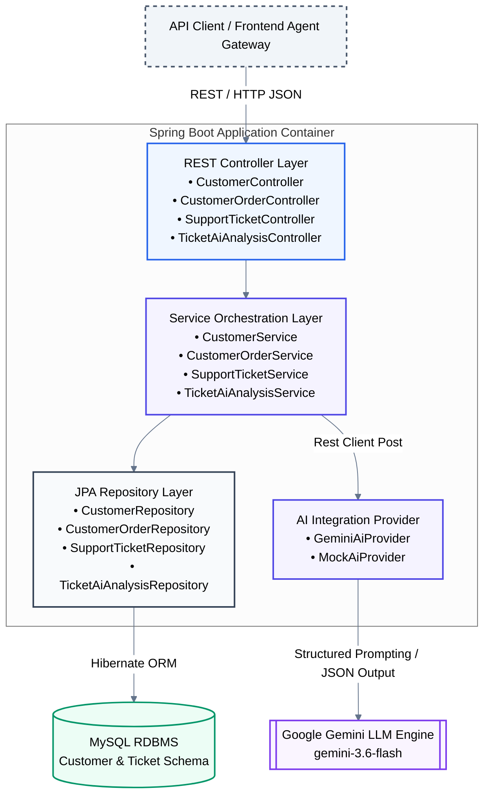
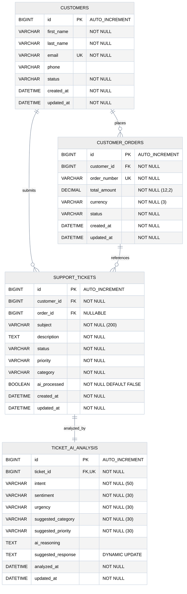
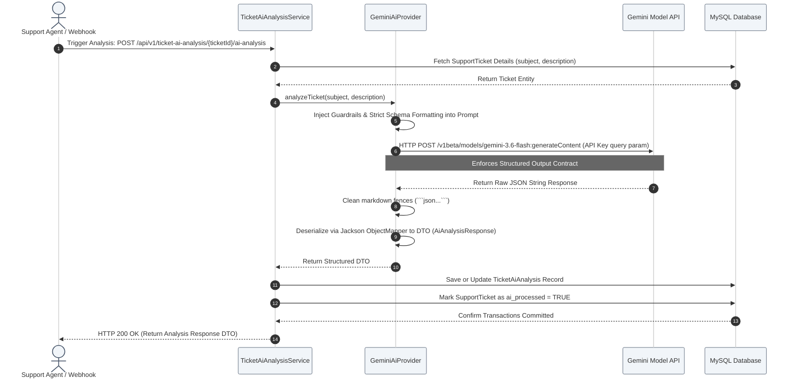

# 🌌 Cognitive Support Intelligence Engine (CSIE)
> **Enterprise-Grade AI-Native Support & Ticket Orchestration System**

<div align="center">
  
  
  
  
  
  
</div>

<p align="center">
  <b>A state-of-the-art, high-performance customer service backend combining transactional integrity with real-time generative AI diagnostics. CSIE harnesses the power of Google Gemini models to automatically classify customer intent, perform deep sentiment analysis, assess urgency levels, and draft highly contextual, empathetic agent responses.</b>
</p>

---

## 🏛️ System Architecture

CSIE is designed around clean architecture principles. It separates the execution layers into clean boundaries, ensuring maintainability, observability, and testability.



---

## 💾 Relational Data Model (ERD)

The relational schema is optimized to store audit-compliant transactional support data while keeping volatile LLM analysis snapshots linked as a strict 1-to-1 extension of support tickets. Flyway is used to orchestrate versioned DDL transitions across dev, staging, and production environments.



---

## ⚡ Real-Time Cognitive Pipeline

When a customer ticket is analyzed, it undergoes strict formatting and parsing cycles to guarantee reliability over dynamic LLM outputs.



---

## ✨ Features & Capabilities

### 🟢 Present Features
- **Modern Java 21 Base**: Leverages modern Java syntax, virtual threads compatibility, and improved pattern matching.
- **RESTful Orchestration**: Clean HTTP interfaces for CRUD actions across Customers, Orders, and Support Tickets.
- **Structured LLM Prompt Engineering**: Binds inputs to precise JSON outputs using a carefully calibrated prompt contract with the `gemini-3.6-flash` model.
- **Auto-Enriched Insights**: Automatically determines:
  - **Sentiment**: Neutral, Positive, Frustrated, Angry.
  - **Urgency**: Low, Medium, High, Critical/Urgent.
  - **Intent Classifications**: Order Delays, Account Issues, Refund/Return Requests, Product Issues, Technical Faults.
  - **Draft Responses**: Generates contextual, ready-to-send agent responses.
- **Hybrid DB Migrations**: Uses Flyway for absolute tracking of schema mutations (V1, V2, V3 migrations included) with Hibernate configured to automatically reconcile metadata additions.
- **Mock Fallback Harness**: Provides a local `MockAiAnalysisService` and `MockAiProvider` for rapid local testing without incurring token costs or requiring active API keys.
- **Global Exception Engine**: Standardized REST error payloads via Spring `@RestControllerAdvice` handling missing entities, illegal transitions, and integration faults gracefully.

### 🔵 Upcoming Implementations (Enterprise Roadmap)
- **Spring Security & OAuth2 Integration**: Adding RBAC (Role-Based Access Control) using Spring Security, securing REST API routes with JWT/OIDC tokens, and distinguishing Customer profiles from Support Agent profiles.
- **Semantic RAG Search (Retrieval-Augmented Generation)**: Vectorizing product documentation and historical resolutions (via PgVector or Qdrant) to feed the Gemini API contextually rich snippets.
- **Event-Driven AI Pipelines**: Migrating ticket analysis triggers to asynchronous processing using Spring Cloud Stream with Apache Kafka or RabbitMQ.
- **Real-Time WebSocket Agent Dash**: Pushing updates dynamically to an agent workstation dashboard when urgent/angry tickets are flagged.
- **Prometheus & Grafana Observability**: Instrumenting custom Micrometer metrics tracking AI response latencies, model token usage, and sentiment breakdown.

---

## 🛠️ Step-by-Step Local Setup

### 📋 Prerequisites
Ensure the following development tooling is installed locally:
- **Java Development Kit (JDK) 21** (e.g., Eclipse Temurin or OpenJDK)
- **Apache Maven 3.9+**
- **MySQL Server 8.0+**
- A valid **Google Gemini API Key** (Get one from [Google AI Studio](https://aistudio.google.com/))

---

### 📂 Directory Configuration
```
customer-support-service/          # Workspace Directory
├── .env.example                  # Environment Variables Template
├── README.md                     # Root Architectural Manual (This file)
└── customer-support-service/     # Spring Boot Maven Project Root
    ├── src/
    │   ├── main/
    │   │   ├── java/             # Source Java Packages
    │   │   └── resources/        # SQL Migrations, Application Properties
    │   └── test/                 # Test Harnesses
    ├── pom.xml                   # Maven Build Config
    └── mvnw                      # Maven Wrapper
```

---

### 🚀 Setup Steps

#### Step 1: Database Initialization
Log into your MySQL instance and run the following command to provision the application database:
```sql
CREATE DATABASE customer_support_dev CHARACTER SET utf8mb4 COLLATE utf8mb4_unicode_ci;
```

#### Step 2: Configure Environment Variables
Copy the workspace level `.env.example` file to create your active configurations. In your terminal:
```bash
cp .env.example .env
```
Open the `.env` file and replace the placeholders with your actual secrets:
```ini
# Database Configuration
SPRING_DATASOURCE_URL=jdbc:mysql://localhost:3306/customer_support_dev?createDatabaseIfNotExist=true&useSSL=false&allowPublicKeyRetrieval=true&serverTimezone=UTC
SPRING_DATASOURCE_USERNAME=your_mysql_user
SPRING_DATASOURCE_PASSWORD=your_mysql_password

# Gemini AI Configuration
GEMINI_API_KEY=AIzaSy...your_gemini_key
GEMINI_BASE_URL=https://generativelanguage.googleapis.com
```

> **Note**: The application's `application.properties` utilizes Spring Property placeholders (e.g., `${SPRING_DATASOURCE_URL}`) that automatically bind to environment variables.

#### Step 3: Clean and Build the Project
Navigate into the maven project subdirectory and compile dependencies:
```bash
cd customer-support-service
./mvnw clean install
```
During the build phase, Flyway migrations will be prepared and compiled into target artifacts.

#### Step 4: Run the Application
Execute the Spring Boot runner:
```bash
./mvnw spring-boot:run
```
Upon successful launch, the application will boot on **port 8282** with the context path `/`. You will see console logs confirming the Flyway schema migration execution:
```
INFO  o.f.c.i.database.DatabaseFactory - Database: jdbc:mysql://localhost:3306/customer_support_dev
INFO  o.f.core.internal.command.DbMigrate - Schema successfully migrated to version 3
```

---

## 📡 API Reference & Usage Guide

Below are detailed, production-ready cURL test scripts and expected JSON responses to verify endpoints.

<details>
<summary><b>1. Customer Directory REST Endpoints</b></summary>

### ➕ Create a Customer
Creates a new customer profile.
```bash
curl -X POST http://localhost:8282/api/v1/customers \
  -H "Content-Type: application/json" \
  -d '{
    "firstName": "John",
    "lastName": "Doe",
    "email": "john.doe@example.com",
    "phone": "+1-555-0199"
  }'
```
**Expected Response (HTTP 201 Created):**
```json
{
  "id": 1,
  "firstName": "John",
  "lastName": "Doe",
  "email": "john.doe@example.com",
  "phone": "+1-555-0199",
  "status": "ACTIVE",
  "createdAt": "2026-08-27T16:05:00",
  "updatedAt": "2026-08-27T16:05:00"
}
```

### 🔍 Get Customer Details
```bash
curl -X GET http://localhost:8282/api/v1/customers/1
```
</details>

<details>
<summary><b>2. Order Catalog REST Endpoints</b></summary>

### ➕ Create a Customer Order
Places a transactional order bound to a customer ID.
```bash
curl -X POST http://localhost:8282/api/v1/orders \
  -H "Content-Type: application/json" \
  -d '{
    "customerId": 1,
    "orderNumber": "ORD-2026-9908",
    "totalAmount": 149.99,
    "currency": "USD"
  }'
```
**Expected Response (HTTP 201 Created):**
```json
{
  "id": 1,
  "customerId": 1,
  "orderNumber": "ORD-2026-9908",
  "totalAmount": 149.99,
  "currency": "USD",
  "status": "PENDING",
  "createdAt": "2026-08-27T16:06:00",
  "updatedAt": "2026-08-27T16:06:00"
}
```

### 🔍 Find Orders by Customer ID
```bash
curl -X GET http://localhost:8282/api/v1/orders/customer/1
```
</details>

<details>
<summary><b>3. Support Ticket REST Endpoints</b></summary>

### ➕ File a Support Ticket
Registers a support query linked to a customer and order.
```bash
curl -X POST http://localhost:8282/api/v1/tickets \
  -H "Content-Type: application/json" \
  -d '{
    "customerId": 1,
    "orderId": 1,
    "subject": "Delay in delivery for my package",
    "description": "I ordered this package five days ago and it was supposed to arrive yesterday. The status is stuck. I am very angry and disappointed. I want a refund if it is not shipped soon.",
    "category": "DELIVERY",
    "priority": "HIGH"
  }'
```
**Expected Response (HTTP 201 Created):**
```json
{
  "id": 1,
  "customerId": 1,
  "orderId": 1,
  "subject": "Delay in delivery for my package",
  "description": "I ordered this package five days ago and it was supposed to arrive yesterday. The status is stuck. I am very angry and disappointed. I want a refund if it is not shipped soon.",
  "status": "OPEN",
  "priority": "HIGH",
  "category": "DELIVERY",
  "aiProcessed": false,
  "createdAt": "2026-08-27T16:10:00",
  "updatedAt": "2026-08-27T16:10:00"
}
```

### ✏️ Update Ticket Status
Moves the ticket along its resolution lifecycle.
```bash
curl -X PATCH http://localhost:8282/api/v1/tickets/1/status \
  -H "Content-Type: application/json" \
  -d '{
    "status": "IN_PROGRESS"
  }'
```
</details>

<details>
<summary><b>4. AI Analysis & Cognitive Endpoints</b></summary>

### 🧠 Trigger Ticket Analysis (AI Engine Execution)
Invokes Gemini to analyze the ticket, classify metadata, and persist the results.
```bash
curl -X POST http://localhost:8282/api/v1/ticket-ai-analysis/1/ai-analysis
```
**Expected Response (HTTP 200 OK):**
```json
{
  "id": 1,
  "ticketId": 1,
  "intent": "ORDER_DELAY",
  "sentiment": "ANGRY",
  "urgency": "URGENT",
  "suggestedCategory": "DELIVERY",
  "suggestedPriority": "HIGH",
  "aiReasoning": "The customer is complaining about a shipment delay ('stuck' status) and explicitly demands a refund, utilizing high-sentiment terms like 'very angry and disappointed'. Urgency is critical as shipment SLA is missed.",
  "suggestedResponse": "Dear John,\n\nWe sincerely apologize for the delay in receiving your package (Order #ORD-2026-9908). We understand how frustrating this situation is, especially since it was expected yesterday. We are tracking the shipment with our carrier immediately to resolve this. If the package does not update within 24 hours, we will issue a full refund as requested. Thank you for your patience.\n\nBest regards,\nSupport Team",
  "analyzedAt": "2026-08-27T16:15:33",
  "updatedAt": "2026-08-27T16:15:33"
}
```

### 🔍 Fetch Cached AI Ticket Analysis
Fetches the saved analytical results from the database for the given ticket.
```bash
curl -X GET http://localhost:8282/api/v1/ticket-ai-analysis/1/ai-analysis
```

### 🧪 Ad-hoc Text Analysis Override
Analyze custom strings without modifying ticket databases. Useful for testing prompts.
```bash
curl -X POST http://localhost:8282/api/v1/tickets/1/ai-analysis \
  -H "Content-Type: application/json" \
  -d '{
    "subject": "Help, my app crashes on payment screen",
    "description": "Whenever I tap buy, the screen goes white and nothing happens. I have tried restarting."
  }'
```
</details>

<details>
<summary><b>5. Actuator Metrics & Diagnostics</b></summary>

### 🏥 App Health Check
```bash
curl -X GET http://localhost:8282/actuator/health
```
**Expected Response:**
```json
{
  "status": "UP",
  "components": {
    "db": {
      "status": "UP",
      "details": {
        "database": "MySQL",
        "validationQuery": "isValid()"
      }
    },
    "ping": {
      "status": "UP"
    }
  }
}
```
</details>

---

## 💎 Elite Coding Conventions

CSIE maintains professional architectural practices:
1. **Immutable Records**: Uses Java Records for DTOs and immutable payload representations where possible.
2. **Spring RestClient**: Upgraded from deprecated `RestTemplate` to the modern, fluent `RestClient` API.
3. **Transaction Isolation**: Service mutations are locked with `@Transactional` to avoid partial writes, especially when writing to the Gemini integrations and operational database simultaneously.
4. **Validation Guard**: Restricts input pollution using `jakarta.validation.constraints` (e.g. `@NotNull`, `@Size`, `@Email`) at the controller boundary.
5. **Standardized Enums**: Standardizes workflow state across models using Java `enum` parameters, eliminating "magic strings" in database records.

---
<div align="center">
  <sub>Developed with 💙 by Antigravity AI & the Enterprise Support Engineering Team</sub>
</div>